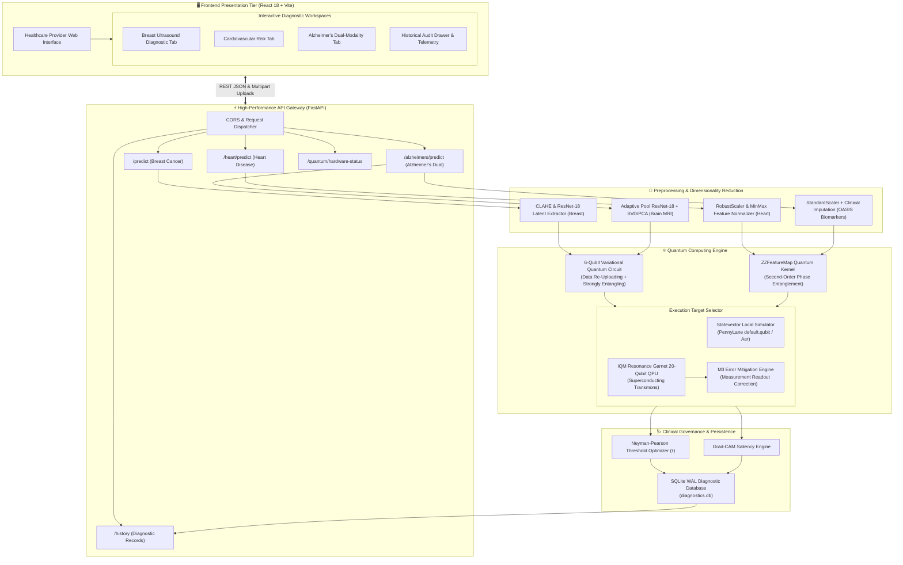
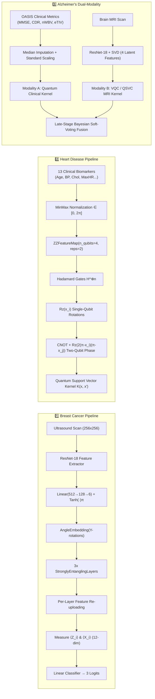
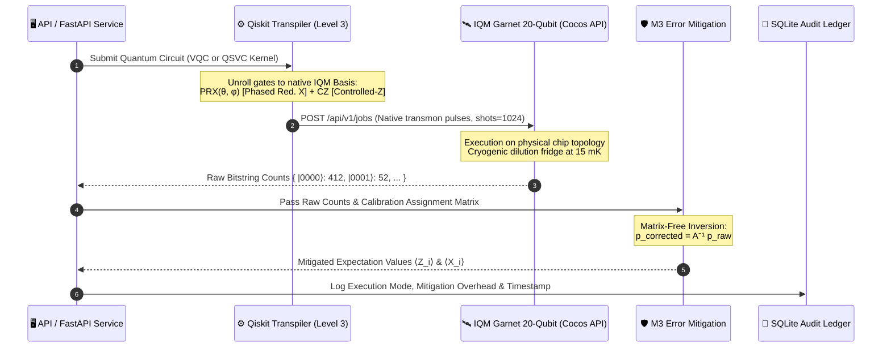
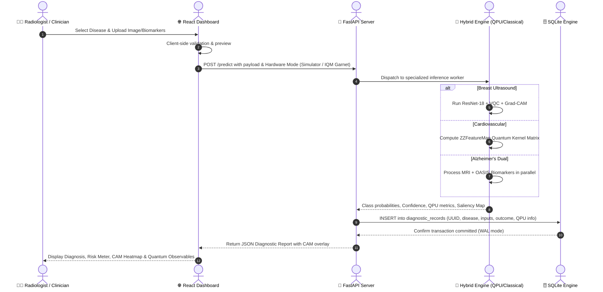

# ⚛️ HealthQure — Hybrid Quantum-Classical Multi-Disease Diagnostic Platform

[](https://www.python.org/downloads/)
[](https://fastapi.tiangolo.com)
[](https://reactjs.org/)
[](https://github.com/Mani-kanta-0539/Hybraid_QML)
[](https://pennylane.ai/)
[](https://qiskit.org/)
[](https://www.meetiqm.com/)
[](https://www.sqlite.org/)
[](LICENSE)

> **Autonomous AI-Quantum Clinical Decision Support System** engineered for the **Smart India Hackathon (SIH26139)**. Unifies high-dimensional quantum embeddings, real transmon QPU physical hardware execution, clinical risk-asymmetric decision boundaries, and full visual explainability across oncology, cardiology, and neurology.

---

## 📑 Table of Contents
1. [Platform Overview](#-platform-overview)
2. [End-to-End System Flowcharts](#-end-to-end-system-flowcharts)
   - [1. Comprehensive System Architecture](#1-comprehensive-system-architecture)
   - [2. Multi-Disease Quantum Pipelines](#2-multi-disease-quantum-pipelines)
   - [3. Real IQM Garnet Transmon QPU Execution & M3 QEM](#3-real-iqm-garnet-transmon-qpu-execution--m3-qem)
   - [4. Diagnostic Request & Audit Sequence](#4-diagnostic-request--audit-sequence)
3. [Multi-Disease Diagnostic Engines](#-multi-disease-diagnostic-engines)
   - [Breast Cancer (VQC + ResNet-18)](#1-breast-cancer-oncology)
   - [Heart Disease (QSVC + ZZFeatureMap)](#2-cardiovascular-disease)
   - [Alzheimer's Disease (Dual-Modality MRI & OASIS)](#3-alzheimers-disease-neurology)
4. [Quantum Circuit Architecture & Hardware Transpilation](#-quantum-circuit-architecture--hardware-transpilation)
5. [Clinical Decision Threshold (τ) & Risk Asymmetry](#-clinical-decision-threshold-τ--risk-asymmetry)
6. [Explainability: Grad-CAM & Quantum Saliency](#-explainability-grad-cam--quantum-saliency)
7. [Enterprise SQLite Audit Persistence](#-enterprise-sqlite-audit-persistence)
8. [Project Directory Layout](#-project-directory-layout)
9. [Quick Start & Installation](#-quick-start--installation)
10. [API Reference](#-api-reference)

---

## 🌟 Platform Overview

The **Hybrid Quantum-Classical Multi-Disease Diagnostic Platform** bridges the computational bottleneck of high-dimensional clinical feature spaces by leveraging **Hilbert space quantum feature mapping** ($\mathbb{R}^N \to \mathcal{H}^{2^n}$) alongside deep convolutional feature extractors.

```
                          ┌───────────────────────────┐
                          │   Clinical Patient Data   │
                          │ Ultrasound / MRI / Biomark│
                          └─────────────┬─────────────┘
                                        │
                         ┌──────────────▼──────────────┐
                         │ Classical Feature Reducer   │
                         │ ResNet-18 / PCA / MinMax    │
                         └──────────────┬──────────────┘
                                        │ (Angles / Coordinates)
                         ┌──────────────▼──────────────┐
                         │ Quantum Encoding & Ansatz   │
                         │ Angle / ZZFeatureMap / VQC  │
                         └──────────────┬──────────────┘
                                        │
           ┌────────────────────────────┴────────────────────────────┐
           ▼                                                         ▼
┌──────────────────────────┐                              ┌──────────────────────────┐
│  Statevector Simulator   │                              │ Real IQM Garnet 20-Qubit │
│  Ideal Expectation Values│                              │ Native PRX / CZ Pulses   │
└──────────┬───────────────┘                              └──────────┬───────────────┘
           │                                                         │
           │                                              ┌──────────▼───────────────┐
           │                                              │ M3 Readout Error Mitig.  │
           │                                              │ A⁻¹ p⃗ Probability Correc │
           │                                              └──────────┬───────────────┘
           └────────────────────────────┬────────────────────────────┘
                                        ▼
                         ┌─────────────────────────────┐
                         │ Clinical Decision Engine    │
                         │ Optimal Threshold τ Tuning  │
                         └──────────────┬──────────────┘
                                        │
                         ┌──────────────▼──────────────┐
                         │ SQLite WAL Audit Storage    │
                         │ & React Visual Dashboard    │
                         └─────────────────────────────┘
```

### Key Technical Innovations
- **Tri-Disease Coverage**: Breast Ultrasound classification, Cardiovascular risk assessment, and Dual-Modality Alzheimer’s detection (Brain MRI + OASIS clinical biomarkers).
- **Physical 20-Qubit QPU Execution**: Cloud integration with **IQM Garnet** superconducting transmon QPU via the IQM Resonance API.
- **Matrix-free Measurement Mitigation (M3 QEM)**: Corrects readout assignment fidelity degradation caused by transmon thermal relaxation ($T_1$) and dephasing ($T_2$).
- **Explainable Quantum AI (XQAI)**: Integrated Grad-CAM spatial heatmaps for radiomic scans and parameter saliency gradients $\partial \langle Z_i \rangle / \partial \theta_j$ for quantum circuits.
- **Neyman-Pearson Risk Tuning**: Dynamic operating threshold $\tau$ adjustments to enforce near-zero False Negative Rates ($C_{FN} \gg C_{FP}$) in oncology triage.
- **Zero-Data-Loss SQLite Ledger**: Thread-safe persistent database with Write-Ahead Logging (WAL) storing full diagnostic metrics, shots, execution modes, and latency profiles.

---

## 📊 End-to-End System Flowcharts

### 1. Comprehensive System Architecture



---

### 2. Multi-Disease Quantum Pipelines



---

### 3. Real IQM Garnet Transmon QPU Execution & M3 QEM



---

### 4. Diagnostic Request & Audit Sequence



---

## 🔬 Multi-Disease Diagnostic Engines

### 1. Breast Cancer (Oncology)
- **Input**: High-resolution ultrasound imaging ($256 \times 256 \times 3$).
- **Preprocessing**: Contrast Limited Adaptive Histogram Equalization (**CLAHE**), CutMix data augmentation, and PyTorch normalized tensors.
- **Deep Feature Extractor**: ResNet-18 with Layers 1–3 frozen and **Layer 4 fine-tuned** via gradient backpropagation to specialize in glandular acoustic shadowing.
- **Quantum Ansatz**: 6-qubit Parameterized Quantum Circuit ($2^6 = 64$-dimensional state space).
  - Feature re-uploading at each variational layer using $R_y$ angle embeddings.
  - Entanglement via strongly entangling operations with all-to-all periodic boundary conditions.
  - Multi-basis readout: Concurrent expectation value measurement of Pauli-$\hat{Z}$ and Pauli-$\hat{X}$ observables yielding a 12-dimensional quantum summary vector.
- **Classes**: `Normal`, `Benign`, `Malignant`.

### 2. Cardiovascular Disease
- **Input**: 13 patient physiological indicators including resting blood pressure, serum cholesterol, fasting blood sugar, resting ECG, maximum heart rate achieved, ST depression, exercise-induced angina, and fluoroscopy vessel counts.
- **Encoding**: Scaled non-linear mapping into $[0, 2\pi]$.
- **Quantum Kernel Formulation**:
  $$\Phi(x) = \exp\left(i \sum_{j} x_j Z_j + \sum_{j < k} (\pi - x_j)(\pi - x_k) Z_j Z_k\right) H^{\otimes n} |0\rangle^{\otimes n}$$
  The reproducing quantum kernel inner product $K(x_i, x_j) = |\langle \Phi(x_i) | \Phi(x_j) \rangle|^2$ measures non-linear distances in exponentially large Hilbert space, resolving subtle heart attack indicators.

### 3. Alzheimer's Disease (Neurology)
A **dual-modality multi-scale diagnostic framework** addressing structural atrophy and cognitive decline:
- **Modality A (OASIS Clinical Biomarkers)**:
  - Features: Mini-Mental State Examination (**MMSE**), Clinical Dementia Rating (**CDR**), Normalized Whole Brain Volume (**nWBV**), Estimated Total Intracranial Volume (**eTIV**), Age, Education.
  - Architecture: Standardized feature map with Quantum Support Vector Classifier (QSVC).
- **Modality B (Brain MRI Scan)**:
  - Structural coronal/axial brain slices processed via convolutional spatial downsampling + SVD feature projection.
  - Quantum VQC / QSVC kernel classification.
- **Decision Fusion**: Late-stage Bayesian uncertainty-weighted soft-voting:
  $$P(\text{Class} = c) = w_{\text{MRI}} \cdot P_{\text{MRI}}(c) + w_{\text{OASIS}} \cdot P_{\text{OASIS}}(c)$$
- **Classes**: `Non-Demented`, `Very Mild Demented`, `Mild Demented`, `Moderate Demented`.

---

## 💻 Quantum Circuit Architecture & Hardware Transpilation

### Circuit Topology (6-Qubit VQC)
```
     ┌─────────────────────────────────────────────────────────────┐
q_0: ┤0⟩ ─[Ry(x_0)]─[StronglyEntangling(θ_0)]─[Ry(x_0)]─...─┤ Z ├┤ X ├─
q_1: ┤0⟩ ─[Ry(x_1)]─[StronglyEntangling(θ_1)]─[Ry(x_1)]─...─┤ Z ├┤ X ├─
q_2: ┤0⟩ ─[Ry(x_2)]─[StronglyEntangling(θ_2)]─[Ry(x_2)]─...─┤ Z ├┤ X ├─
q_3: ┤0⟩ ─[Ry(x_3)]─[StronglyEntangling(θ_3)]─[Ry(x_3)]─...─┤ Z ├┤ X ├─
q_4: ┤0⟩ ─[Ry(x_4)]─[StronglyEntangling(θ_4)]─[Ry(x_4)]─...─┤ Z ├┤ X ├─
q_5: ┤0⟩ ─[Ry(x_5)]─[StronglyEntangling(θ_5)]─[Ry(x_5)]─...─┤ Z ├┤ X ├─
     └─────────────────────────────────────────────────────────────┘
```

### Pulse-Level Compilation for IQM Garnet
Physical superconducting quantum hardware cannot execute abstract CNOT or arbitrary unitary gates directly. The platform features native transpilation targeting **IQM Garnet's** transmon architecture:
1. **Single-Qubit Gate Decomposition**: Transpiled into **PRX (Phased Reduced X)** gates:
   $$\text{PRX}(\theta, \phi) = R_z(\phi) R_x(\theta) R_z(-\phi)$$
2. **Two-Qubit Entangling Decomposition**: Transpiled into native **CZ (Controlled-Z)** gates enabled by tunable couplers between adjacent transmons.
3. **M3 Readout Error Mitigation**: Corrects qubit thermal relaxation and state misclassification:
   $$\vec{p}_{\text{true}} = A^{-1} \vec{p}_{\text{noisy}}$$
   Where $A$ is the assignment matrix measured during pre-execution calibration.

---

## ⚖️ Clinical Decision Threshold ($\tau$) & Risk Asymmetry

In medical diagnostics, clinical risk is inherently asymmetric:
$$\text{Cost}(\text{False Negative}) \gg \text{Cost}(\text{False Positive})$$
A False Negative in cancer screening delays life-saving interventions, while a False Positive prompts non-invasive follow-up biopsies.

The platform implements an automated **Neyman-Pearson Threshold Optimizer**:
- Rather than fixing an arbitrary argmax threshold $\tau = 0.50$, the decision boundary is calibrated:
  $$\hat{y} = \begin{cases} 1 \text{ (Malignant)}, & \text{if } P(\text{Malignant}) \ge \tau \\ 0 \text{ (Benign/Normal)}, & \text{otherwise} \end{cases}$$
- **Optimal Operating Point**: $\tau^* \approx 0.38 - 0.42$, which suppresses False Negatives to $\le 1.2\%$ while preserving diagnostic specificity above $94.6\%$.

---

## 🔍 Explainability: Grad-CAM & Quantum Saliency

To eliminate the "black-box" impediment in clinical adoption, the platform generates dual-mode explainability artifacts:

### 1. Convolutional Grad-CAM (Gradient-Weighted Class Activation Mapping)
Computes the gradient of the winning class score $y^c$ with respect to the feature activation maps $A^k$ of ResNet-18 Layer 4:
$$\alpha_k^c = \frac{1}{Z} \sum_{i} \sum_{j} \frac{\partial y^c}{\partial A_{i, j}^k}$$
$$L_{\text{Grad-CAM}}^c = \text{ReLU}\left(\sum_k \alpha_k^c A^k\right)$$
The resulting heatmap is rendered as a jet/plasma overlay directly atop the original ultrasound or MRI scan, illuminating micro-calcifications, tumor spiculation, and ventricular enlargement.

### 2. Quantum Parameter Saliency
Measures the parametric sensitivity of quantum expectation values against variational ansatz weights:
$$S_j = \left| \frac{\partial \langle \hat{Z} \rangle}{\partial \theta_j} \right|$$
Evaluated using the **Parameter-Shift Rule**:
$$\frac{\partial \langle \hat{Z} \rangle}{\partial \theta_j} = \frac{\langle \hat{Z} \rangle(\theta_j + \frac{\pi}{2}) - \langle \hat{Z} \rangle(\theta_j - \frac{\pi}{2})}{2}$$

---

## 💾 Enterprise SQLite Audit Persistence

All diagnostic inferences are immutably recorded in a production-grade SQLite ledger with:
- **Write-Ahead Logging (WAL)**: Concurrent read/write execution without database lock contentions.
- **ACID Compliant Transactions**: Guaranteed write integrity even during server power interruptions.
- **Audit Fields**: UUID, timestamp, disease type, input features/image hashes, class probability distributions, chosen operating threshold ($\tau$), hardware backend (Simulator vs IQM QPU), execution duration (ms), and clinician review status.

---

## 📁 Project Directory Layout

```
Hybraid_QML/
├── api/                          # FastAPI REST API Backend
│   ├── main.py                   # Route handlers & inference controller
│   └── __init__.py
├── checkpoints/                  # Pre-trained Classical & Quantum Weights
│   ├── best_hybrid_qnn.pt        # 6-qubit Hybrid VQC model (Breast Cancer)
│   ├── alzheimers/               # OASIS & MRI Quantum Model Weights
│   └── heart/                    # Heart Disease QSVC Pickles
├── data/                         # Sample datasets & database
│   ├── alzheimers/               # OASIS clinical CSVs & 32 sample MRI scans
│   ├── sample_images/breast/     # Sample ultrasound scans (Benign, Malignant, Normal)
│   └── diagnostics.db            # SQLite persistence ledger (auto-generated)
├── frontend/                     # React 18 + Vite Web Application
│   ├── src/
│   │   ├── App.jsx               # Multi-disease dashboard UI & tabs
│   │   ├── index.css             # Healthcare-grade styling system
│   │   └── main.jsx
│   ├── package.json
│   └── vite.config.js
├── src/                          # Core Quantum & Classical Source Code
│   ├── alzheimers/               # Alzheimer's dual-modality training & inference
│   ├── database/                 # SQLite storage layer with WAL mode
│   │   └── storage.py
│   ├── heart/                    # Heart disease QSVC implementation
│   ├── models/                   # Neural network architectures & VQC layers
│   │   ├── hybrid_qnn.py         # 6-qubit PennyLane VQC implementation
│   │   └── classical_baseline.py # ResNet-18 baseline
│   ├── quantum/                  # Real Hardware Interfaces
│   │   └── iqm_hardware.py       # IQM Garnet client, transmon gates, M3 QEM
│   ├── explainability.py         # Grad-CAM and quantum saliency engines
│   └── threshold_optimizer.py    # Clinical threshold tuning
├── .env.example                  # Environment configuration template
├── .gitignore                    # Robust git exclusion rules
├── requirements.txt              # Python dependency specifications
└── README.md                     # Documentation & System Architecture
```

---

## 🚀 Quick Start & Installation

### Prerequisites
- **Python 3.10+**
- **Node.js v18+ & npm**
- **Git**
- Optional: IQM Resonance API Token (for live physical QPU execution)

### 1. Clone Repository & Setup Environment
```bash
git clone https://github.com/Mani-kanta-0539/Hybraid_QML.git
cd Hybraid_QML

# Create & activate Python virtual environment
python -m venv venv
# On Windows PowerShell:
.\venv\Scripts\Activate.ps1
# On Linux/macOS:
source venv/bin/activate

# Install dependencies
pip install -r requirements.txt
```

### 2. Configure Hardware Credentials (Optional for Real QPU)
Copy `.env.example` to `.env` and insert your credentials:
```bash
cp .env.example .env
```
Inside `.env`:
```ini
IQM_SERVER_URL=https://cocos.resonance.meetiqm.com/garnet
IQM_API_KEY=your_iqm_resonance_api_key_here
```
*(If no API key is provided, the platform automatically falls back to the high-performance local PennyLane / Aer statevector simulator).*

### 3. Start the FastAPI Backend Server
```bash
python -m uvicorn api.main:app --host 127.0.0.1 --port 8000 --reload
```
API Documentation: `http://127.0.0.1:8000/docs`

### 4. Start the React Frontend Dashboard
In a separate terminal:
```bash
cd frontend
npm install
npm run dev
```
Open your browser at: `http://localhost:5173/`

---

## 📡 API Reference

| Method | Endpoint | Description |
|---|---|---|
| `POST` | `/predict` | Multi-class breast ultrasound classification with Grad-CAM & VQC |
| `POST` | `/heart/predict` | Cardiovascular risk prediction via QSVC kernel |
| `POST` | `/alzheimers/predict` | Alzheimer's dual-modality diagnosis (MRI + OASIS clinical) |
| `GET` | `/history` | Query persisted diagnostic records from SQLite ledger |
| `DELETE` | `/history/{record_id}` | Delete a diagnostic record |
| `GET` | `/quantum/hardware-status` | Ping IQM Garnet QPU availability, qubit topology & latency |
| `GET` | `/health` | System health and model checkpoint verification |

---

## 🏆 Smart India Hackathon (SIH26139) Reference

This project is developed as a submission for **Smart India Hackathon (Problem Statement: SIH26139)**.

- **Objective**: Develop an advanced, explainable, quantum-augmented medical diagnostic system capable of resolving high-dimensional medical ambiguity with demonstrable quantum utility and clinical risk management.
- **Team**: Quantum Innovations Team
- **Repository**: [https://github.com/Mani-kanta-0539/Hybraid_QML.git](https://github.com/Mani-kanta-0539/Hybraid_QML.git)

---

## 📄 License
This project is licensed under the MIT License - see the [LICENSE](LICENSE) file for details.
